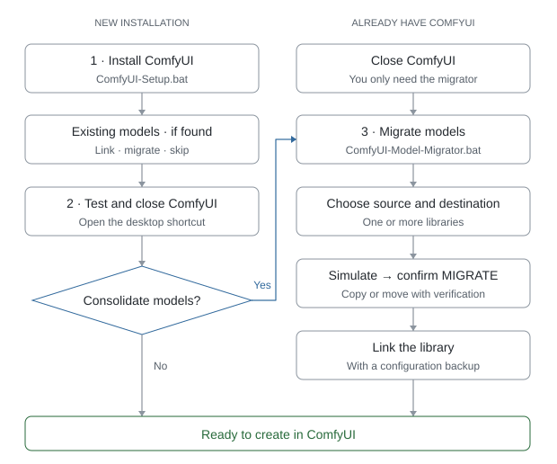

  

<h1 align="center">Clean ComfyUI Installation</h1>

  <strong>Automatic, adaptive installer for Windows</strong> 
  NVIDIA · AMD · Intel

  
  

  <a href="README.md">Español</a> · <strong>English</strong>

  Installs ComfyUI from scratch, detects the computer's hardware and automatically configures a suitable installation.

   
   
  Only what you need to install; the documentation stays here on GitHub.

  No sponsors · No promotional shortcuts · No unnecessary software · No required models 
  Made by <a href="https://www.youtube.com/@cineconia.oficial">Cine con IA · YouTube</a> · <a href="https://discord.gg/hXKJ78cEua">Discord community</a> · Independent project, not affiliated with Comfy Org

---

> [!TIP]
> **💬 Questions or problems with the installation?** Ask the Cine con IA community on Discord (Spanish-speaking): [discord.gg/hXKJ78cEua](https://discord.gg/hXKJ78cEua) · Tutorials on [YouTube](https://www.youtube.com/@cineconia.oficial).

## Automatic language selection

The installer and model migrator detect the language configured in Windows.

- Spanish Windows (display language or regional format) → Spanish.
- English or another Windows language → English.
- It asks nothing: it starts directly in the right language.
- If needed, force it with **--lang es** or **--lang en**.

Language-neutral entry files:

- **ComfyUI-Setup.bat** — installation.
- **ComfyUI-Model-Migrator.bat** — model migration.

Spanish compatibility aliases are also included:
**Instalar-ComfyUI.bat** and **Migrar-Modelos-ComfyUI.bat**. They run the same bilingual system.

## Which file should I run first?

For a new installation, the recommended order is:

1. **First: ComfyUI-Setup.bat**
   - Installs ComfyUI.
   - Detects the GPU and appropriate backend.
   - Configures compatible accelerators.
   - Offers the classic ComfyUI-Manager ("Manager" button).
   - Offers to install the Cine con IA custom nodes.
   - Offers to install the resource monitor (CPU, RAM, GPU, VRAM).
   - Offers the interface extras: the green progress bar at the top
     (rgthree-comfy) and the Show Image Feed button (Custom-Scripts).
   - Docks the job queue in the side panel, without the floating progress
     panel over the canvas (it can be turned back on in ComfyUI).
   - Offers the community nodes (Essentials, Comfyroll, WAS, ControlNet aux).
     They are heavy and are not installed by default.
   - Looks for models from previous installations and offers to use them where they are
     or move them to a central library on another drive.
   - Creates launchers and a desktop shortcut named **ComfyUI**.

2. **Test ComfyUI once**
   - Open the **ComfyUI** desktop shortcut.
   - Make sure the interface starts correctly.
   - Close ComfyUI before migrating models.

3. **Only if you want to gather your models on another drive: ComfyUI-Model-Migrator.bat**
   - Finds or lets you select an existing model library.
   - Lets you choose another SSD/HDD for the models.
   - Shows a simulation first.
   - Can copy or safely move the files.
   - Can link the new library through extra_model_paths.yaml.

In short:

  <picture>
    <source media="(prefers-color-scheme: dark)" srcset=".github/assets/installation-flow-en-dark.svg">
    
  </picture>

If you are starting from scratch and have no old models, you do not need to run the migrator.

If you already have ComfyUI and only want to reorganize or move its model library, you can run the model migrator independently.

## Quick start

1. Download **CineConIA-Installer.zip** with the button above and extract it into a
   simple folder such as **C:\ComfyUI**.
   Avoid OneDrive and paths with accents.
2. Run **ComfyUI-Setup.bat**.
3. Use the recommended automatic configuration, or choose Advanced mode.

When installation finishes there is a single desktop shortcut named **ComfyUI**.
The installer does not create promotional channel shortcuts or replace ComfyUI branding.

## How the adaptive installation works

### Before downloading

- Detects NVIDIA, AMD, or Intel.
- Modern NVIDIA cards (16/20 series or newer) use the official NVIDIA portable
  build (CUDA 13, Python 3.13).
- NVIDIA GPUs below compute capability 7.5 (GTX 10xx, GTX 9xx, TITAN V...) use the
  official nvidia_cu126 build (CUDA 12.6, Python 3.12).
- Modern card with a driver older than 580: the installer no longer falls back to
  CUDA 12.6 on its own. It recommends updating the driver (opens the NVIDIA page
  and closes the installer) and lets you install CUDA 13 anyway or CUDA 12.6.
- Before downloading it lists both CUDA versions with the recommended one
  marked; **Enter** accepts it. It has guards: CUDA 13 is never installed on cards
  older than the 16/20 series, and CUDA 12.6 is never installed on the 50 series,
  which only works with CUDA 13.
- You can also set it when running it: **ComfyUI-Setup.bat --cuda 12.6** or
  **--cuda 13**, with the same guards.
- AMD uses the official AMD/ROCm portable build.
- Intel uses the official Intel XPU portable build.
- Checks free space (15 GB), curl, and PowerShell.
- Warns when the folder is inside OneDrive or the path contains accents.

### Safer downloads

- Uses curl --fail so HTTP errors are not mistaken for successful downloads.
- Retries downloads.
- Downloads large files as .part first.
- If the download is interrupted, running the installer again resumes it.
- Compares the ComfyUI archive with the SHA-256 digest published by GitHub when available.
- Falls back to a 7-Zip integrity test if the release API does not provide a digest.
- Preserves an incomplete previous installation as a backup before reinstalling.
- Deletes the .7z archive after extraction to free ~2 GB.

### After ComfyUI is installed

The installer first checks for the Microsoft Visual C++ Redistributable (without it
PyTorch fails with a c10.dll error) and offers to install it with winget.

It then runs the embedded Python that belongs to the downloaded portable build and reads the environment that actually exists:

- Python.
- PyTorch.
- Real CUDA / ROCm-HIP / Intel XPU backend.
- GPU visible to PyTorch.
- VRAM.
- Compute capability when applicable.

If PyTorch cannot use the GPU (almost always an old driver), it warns before
continuing instead of leaving an installation that would only use the CPU.

Optional accelerators are then matched against that real environment instead of assuming a CUDA version.

## Accelerators

### Automatic configuration

On NVIDIA, SageAttention is attempted only when a wheel matches the actual PyTorch, CUDA, and Python combination, including wheels published for "this PyTorch version and higher". Triton is installed at the same version PyTorch itself declares on PyPI, and only when triton-windows has already published it. Because the portable's embedded Python lacks the include and libs folders Triton needs to compile, the installer adds them (triton-windows publishes them for each Python version).

AMD and Intel stay on their official portable backend and do not enter NVIDIA CUDA logic.

### Advanced mode

When compatible, advanced mode can offer:

- SageAttention.
- FlashAttention: searched in two sources (mjun0812 publishes for recent PyTorch versions; kingbri1 for older ones).
- Nunchaku: 4-bit **image** models (FLUX, Qwen-Image, Z-Image) for low-VRAM computers. Video does not need it. If your PyTorch is newer than the last one Nunchaku supports, the installer offers to switch to that version with the same CUDA; it saves the current state first (pip freeze in _cineconia\) and rolls back on its own if anything stops loading. It also installs the ComfyUI-nunchaku node.
- InsightFace / ONNX Runtime.

### PyTorch protection

Extras are installed with constraints preserving the portable's torch, torchvision and torchaudio versions, including AMD and Intel builds. Incompatible requirements are reported. If PyTorch still changes, recovery is attempted; an unsuccessful recovery stops installation. Automatic recovery requires a compatible source for the original build and is not assumed for custom AMD builds.

A downloaded folder is not considered a working node. Dependency errors remain visible, and rerunning the installer rechecks existing node requirements. Incomplete folders are backed up before replacement.

After all extras, the installer runs pip check, accelerator tests, and a ComfyUI startup check without opening a browser or leaving a server running. Node packages must appear in the import log. Errors are not presented as a complete installation. This checks loading, not image or video generation through every node. SageAttention and FlashAttention also run a real GPU attention operation; only verified accelerators receive a launcher.

## ComfyUI-Manager

The installer offers the **classic ComfyUI-Manager**, installed as a custom node in custom_nodes\comfyui-manager: the **"Manager"** button in the top bar, with "Install Missing Custom Nodes", "Model Manager", "Update All" and so on. It is the same interface almost every tutorial shows.

ComfyUI also ships an integrated Manager (--enable-manager, "Manage Extensions" button), but it has a different interface and, when enabled, disables the classic one. That is why the launchers do not use that flag. The integrated one is used only when Git is not available to install the classic one.

## Generated launchers

Launcher names follow the selected language. In English, examples include:

- Start-ComfyUI.bat
- Start-ComfyUI-Kitchen.bat
- Start-ComfyUI-SageAttention.bat
- Start-ComfyUI-FlashAttention.bat
- Start-ComfyUI-DynamicVRAM.bat on AMD
- Update-ComfyUI.bat
- Update-ComfyUI-and-Nodes.bat

Spanish installations use the equivalent Iniciar/Actualizar names.

Launchers check port 8188. If ComfyUI is already running, the existing interface is opened instead of launching a second instance.

The updaters move ComfyUI to the **latest stable release** (not the development branch). Update-ComfyUI-and-Nodes.bat saves a Manager snapshot first so you can roll back.

## Desktop shortcut

Only one desktop shortcut is created: **ComfyUI**.

It points to the best launcher that was actually verified:

1. SageAttention, if it works.
2. Comfy Kitchen, if available (NVIDIA only).
3. Base launcher as a fallback.

The shortcut uses the current ComfyUI logo (blue background, yellow "C"), shipped inside the installer as assets\ComfyUI.ico: it needs no download and is never replaced by channel branding.

## Git and custom nodes

Git is checked before cloning custom nodes. If Git is missing and winget is available, the installer asks whether Git for Windows should be installed.

It then offers to install:

- https://github.com/chaLords/ComfyUI-Cine-con-IA
- https://github.com/crystian/ComfyUI-Crystools — CPU, RAM, GPU, VRAM and temperature monitor in the ComfyUI top bar.
- Video nodes, with a single question: what MiniMax H3 and LTX workflows use.
  - https://github.com/kijai/ComfyUI-KJNodes
  - https://github.com/Kosinkadink/ComfyUI-VideoHelperSuite
  - https://github.com/city96/ComfyUI-GGUF — GGUF models, the way to save VRAM for video.
  - https://github.com/facok/comfyui-SelfLift — progressive rendering for H3: first steps at low resolution, the rest at full resolution.
  - https://github.com/LBH-123-AI/Comfyui_Minimax_h3_latent_Upscaler — the H3 latent upscaler. Without it, Cine con IA's "Escalar y refinar" cannot raise the resolution of the second pass.
- Interface extras, with a single question (yes by default). They have no Python dependencies.
  - https://github.com/rgthree/rgthree-comfy — the green progress bar at the top of the screen (queue, percentage and the running node) and widely used nodes such as Fast Groups Bypasser and Power Lora Loader.
  - https://github.com/pythongosssss/ComfyUI-Custom-Scripts — the Show Image Feed button with your generated images, and autocomplete.
- Community nodes, with a single question (no by default): what many shared workflows ask for. They bring heavy dependencies and add several minutes to the installation. If you skip them, ComfyUI offers them through the Manager ("Missing Node Packs") when you open a workflow that needs them.
  - https://github.com/cubiq/ComfyUI_essentials
  - https://github.com/Suzie1/ComfyUI_Comfyroll_CustomNodes
  - https://github.com/ltdrdata/was-node-suite-comfyui — WAS Node Suite.
  - https://github.com/Fannovel16/comfyui_controlnet_aux — depth, pose and edge maps for ControlNet.

### On-screen progress

Installation runs in 14 numbered steps (`[5/14] Accelerators`). Each step closes with its own line: ✓ when done, a dash when skipped and ✗ when it failed. pip and git progress bars never stay half-drawn on screen: a small indicator shows while they run and disappears when they finish, and the full output goes to `ComfyUI\_cineconia\instalacion.log`. At the end, a summary lists every step and the total time.

## Models

The installer does **not download models**.

After a successful migration, the central library path is remembered for this
Windows user in `%LOCALAPPDATA%\CineConIA\bibliotecas.json`. A freshly downloaded
installer offers that library first, even on another drive or outside the search
depth. Choose **Use them where they are** to link the new ComfyUI without copying
models. The central library is marked `is_default`, so components that respect
this configuration use it as their preferred location, including downloads.
If the drive is disconnected or its letter changed, the installer shows a warning.
The registry belongs to this Windows user and computer; on another computer,
select the library through the migrator. No second copy is created automatically.

It automatically searches your local drives for model folders from previous installations. Only if it finds one does it ask what to do:

1. **Use them where they are**: links them through extra_model_paths.yaml without copying or moving anything.
2. **Move them to a central library on another drive**: opens the same migrator as ComfyUI-Model-Migrator.bat (simulation, MIGRATE confirmation, SHA-256) and, when done, also links this ComfyUI to the new library.
3. **Do nothing.**

In later installations the central library is listed first and marked, so every future ComfyUI uses the same models on the drive you chose. It recognizes ComfyUI libraries as well as A1111 / Forge ones (Stable-diffusion, Lora, ESRGAN...).

The search covers every fixed local drive (not USB or network drives) and is bounded by depth, number of scanned folders, and number of results.

If extra_model_paths.yaml already exists, a .bak copy is made first and only the CineConIA-managed block is changed.

## Migrating models from an existing ComfyUI

Use **ComfyUI-Model-Migrator.bat** when you already have a large model collection.

Recommended flow:

1. Close ComfyUI.
2. Run the model migrator.
3. Let it search for old libraries or select them manually.
4. You can add multiple installations and consolidate them into one library.
5. Choose a parent folder on a large drive, for example:
   D:\AI\Models\ComfyUI
6. The resulting library is organized inside:
   D:\AI\Models\ComfyUI\models
7. Choose:
   - **Copy** — keeps all originals.
   - **Safe move** — copies the entire library, even on the same drive, verifies
     every copy with SHA-256, then rechecks the full operation before deleting
     any originals. Requires room for both copies. A copy or verification error
     preserves every original.
8. Review the **SIMULATION** before anything changes.
9. Type **MIGRATE** to confirm in English mode.
10. While copying and verifying, a progress bar shows the percentage, the GB done,
    the time left, what is being done and to which file; it is the same bar used for
    the download, the extraction and the rest of the installation. The percentage also shows
    on the Windows Terminal tab and its taskbar icon. Each phase ends with a summary
    and its duration.
11. The migrator can update extra_model_paths.yaml for recognized ComfyUI installations.

### Model library structure

    models\
        checkpoints\
        diffusion_models\
        unet\
        text_encoders\
        clip\
        clip_vision\
        vae\
        loras\
        controlnet\
        upscale_models\
        embeddings\
        hypernetworks\
        style_models\
        gligen\
        latent_upscale_models\
        frame_interpolation\
        vae_approx\
        _sin_clasificar\

The internal folder _sin_clasificar remains language-independent so the same model library can be shared by Spanish and English installations. Files are placed there only when they cannot be classified safely from their existing folder structure. A1111 / Forge folders are translated to their equivalent (Stable-diffusion → checkpoints, Lora → loras, ESRGAN → upscale_models). The empty put_*_here placeholders from the portable build are ignored.

### Duplicates and conflicts

- Possible duplicates are confirmed with SHA-256.
- Same filename but different content is never overwritten; the conflict is preserved with a suffix such as __conflicto_2.
- In safe-move mode, no originals are removed until the entire operation has been copied and verified. Each pair is checked again immediately before deletion.
- If an error occurs, that original remains untouched.

### extra_model_paths.yaml

For recognized ComfyUI sources, the migrator can point the old installation to the new shared library.

If extra_model_paths.yaml already exists:

- a timestamped .bak backup is created first;
- only the CineConIA-managed block is added or replaced;
- unrelated configuration is preserved.

This allows several ComfyUI installations to share one 500 GB, 1 TB, or larger library on another drive.

### Migration report

Every confirmed migration stores a JSON report under:

    <library>\_cineconia_migracion\

It records sources, destination, migration mode, duplicates, conflicts, errors, and updated extra_model_paths.yaml files.

## Compatibility philosophy

Version 2.5.0 was tested on Windows 11 with an RTX 4060 Ti: startup, loading
14 node packages, GPU SageAttention and a second installer run. Physical AMD,
Intel and Nunchaku profile tests are still pending.
[See the validation scope](.github/VALIDATION.md).

Compatible → install and verify.
Uncertain → skip.
Not compatible → use a fallback.

An optional optimization should never break a working base installation.

## License

The installer is MIT. ComfyUI and external components keep their own licenses. See [assets/THIRD_PARTY_NOTICES.md](assets/THIRD_PARTY_NOTICES.md).
