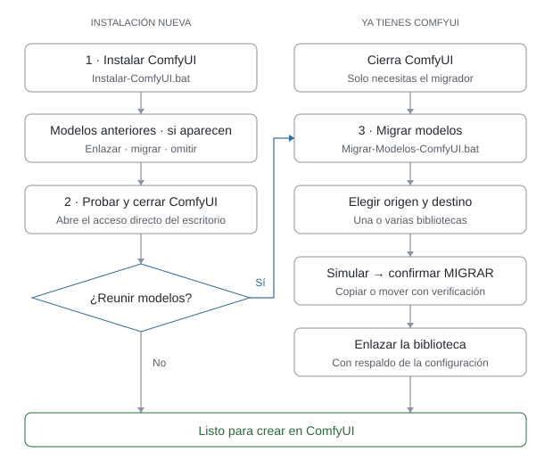

  

<h1 align="center">Instalación limpia de ComfyUI</h1>

  <strong>Instalador automático y adaptativo para Windows</strong> 
  NVIDIA · AMD · Intel

  
  

  <strong>Español</strong> · <a href="README.en.md">English</a>

  Instala ComfyUI desde cero, detecta el hardware del equipo y configura automáticamente una instalación adecuada.

   
  Solo lo necesario para instalar; la documentación queda aquí en GitHub.

  Sin sponsors · Sin accesos promocionales · Sin software innecesario · Sin modelos obligatorios 
  Desarrollado por <a href="https://www.youtube.com/@cineconia.oficial">Cine con IA · YouTube</a> · <a href="https://discord.gg/hXKJ78cEua">Comunidad en Discord</a> · Proyecto independiente, no afiliado a Comfy Org

---

> [!TIP]
> **💬 ¿Dudas o problemas con la instalación?** Pregunta en la comunidad de Cine con IA en Discord: [discord.gg/hXKJ78cEua](https://discord.gg/hXKJ78cEua) · Tutoriales en [YouTube](https://www.youtube.com/@cineconia.oficial).

## Idioma automático

El instalador y el migrador detectan el idioma configurado en Windows.

- Windows en español (interfaz o formato regional) → Español.
- Windows en inglés u otro idioma → English.
- No pregunta nada: empieza directamente en el idioma correcto.
- Si hace falta, se puede forzar con **--lang es** o **--lang en**.

Los archivos neutrales para cualquier usuario son:

- **ComfyUI-Setup.bat** — instalación.
- **ComfyUI-Model-Migrator.bat** — migración de modelos.

Para mantener compatibilidad también existen **Instalar-ComfyUI.bat** y
**Migrar-Modelos-ComfyUI.bat**; ambos llaman al mismo sistema bilingüe.

## ¿Qué archivo ejecuto primero?

Para una instalación nueva, el orden recomendado es este:

1. **Primero: Instalar-ComfyUI.bat**
   - Instala ComfyUI.
   - Detecta la GPU y el backend apropiado.
   - Configura los aceleradores compatibles.
   - Instala ComfyUI-Manager clásico (botón "Manager") si lo aceptas.
   - Instala los nodos Cine con IA si lo aceptas.
   - Instala el monitor de recursos (CPU, RAM, GPU, VRAM) si lo aceptas.
   - Instala los extras de interfaz si lo aceptas: la barra de progreso verde
     de arriba (rgthree-comfy) y el botón Show Image Feed (Custom-Scripts).
   - Deja la cola de trabajos en el panel lateral, sin el panel flotante de
     progreso encima del lienzo (se puede volver a activar en ComfyUI).
   - Ofrece los nodos de la comunidad (Essentials, Comfyroll, WAS, ControlNet
     aux). Son pesados y por defecto no se instalan.
   - Busca modelos de instalaciones anteriores y ofrece usarlos donde están
     o llevarlos a una biblioteca central en otro disco.
   - Crea los lanzadores y el acceso directo de escritorio **ComfyUI**.

2. **Prueba ComfyUI una vez**
   - Abre el acceso directo **ComfyUI**.
   - Comprueba que la interfaz inicia correctamente.
   - Luego cierra ComfyUI antes de migrar modelos.

3. **Después, solo si quieres reunir tus modelos en otro disco: Migrar-Modelos-ComfyUI.bat**
   - Busca o permite seleccionar la biblioteca antigua.
   - Permite elegir otro SSD/HDD para los modelos.
   - Primero hace una simulación.
   - Luego puede copiar o mover de forma segura.
   - Finalmente puede enlazar la nueva biblioteca mediante extra_model_paths.yaml.

En forma resumida:

  <picture>
    <source media="(prefers-color-scheme: dark)" srcset=".github/assets/installation-flow-es-dark.svg">
    
  </picture>

**Si empiezas desde cero y no tienes modelos antiguos, no necesitas ejecutar
Migrar-Modelos-ComfyUI.bat.**

**Si ya tenías un ComfyUI anterior y solo quieres ordenar/mover sus modelos,
también puedes usar Migrar-Modelos-ComfyUI.bat de forma independiente.**

## Inicio rápido

1. Descarga **CineConIA-Installer.zip** con el botón de arriba y descomprímelo en una
   carpeta simple, por ejemplo **C:\ComfyUI**.
   Evita OneDrive y rutas con tildes o eñes.
2. Ejecuta **Instalar-ComfyUI.bat**.
3. Usa la configuración automática recomendada o entra al modo avanzado.

Al terminar queda un único acceso directo llamado **ComfyUI** en el escritorio.
No se crean accesos al canal, launchers promocionales ni branding de Cine con IA.

## Cómo decide la instalación

### Antes de descargar

- Detecta NVIDIA, AMD o Intel.
- NVIDIA moderno (serie 16/20 o superior) usa el portable oficial NVIDIA
  (CUDA 13, Python 3.13).
- NVIDIA con compute capability menor a 7.5 (GTX 10xx, GTX 9xx, TITAN V...) usa el
  portable oficial nvidia_cu126 (CUDA 12.6, Python 3.12).
- Tarjeta moderna con driver anterior al 580: ya no baja a CUDA 12.6 por su
  cuenta. Recomienda actualizar el driver (abre la página de NVIDIA y cierra el
  instalador) y deja elegir entre instalar CUDA 13 igual o CUDA 12.6.
- Antes de descargar muestra las dos versiones de CUDA con la recomendada
  marcada; **Enter** la acepta. Tiene protecciones: CUDA 13 no se instala en tarjetas
  anteriores a la serie 16/20, y CUDA 12.6 no se instala en la serie 50, que solo
  funciona con CUDA 13.
- También se puede fijar al ejecutarlo: **ComfyUI-Setup.bat --cuda 12.6** o
  **--cuda 13**, con las mismas protecciones.
- AMD usa el portable AMD/ROCm oficial.
- Intel usa el portable Intel XPU oficial.
- Comprueba espacio libre (15 GB), curl y PowerShell.
- Avisa si la carpeta está dentro de OneDrive o si la ruta tiene tildes o eñes.

### Descarga robusta

- curl --fail para no confundir un 404/500 con una descarga correcta.
- Reintentos automáticos.
- Archivos grandes se descargan primero como .part.
- Si la descarga se corta, al volver a ejecutar el instalador continúa donde quedó.
- El .7z de ComfyUI se compara con el SHA-256 que publica GitHub cuando existe.
- Si GitHub no entrega digest, se hace al menos una prueba de integridad con 7-Zip.
- Una instalación parcial previa se conserva como respaldo antes de reinstalar.
- Tras extraer, el paquete .7z se elimina para liberar ~2 GB.

### Después de instalar ComfyUI

El instalador comprueba primero Microsoft Visual C++ Redistributable (sin él
PyTorch falla con el error c10.dll) y ofrece instalarlo con winget.

Después ejecuta el **python_embeded del portable** y detecta lo que
realmente quedó instalado:

- Python.
- PyTorch.
- CUDA real / ROCm-HIP / Intel XPU.
- GPU que PyTorch reconoce.
- VRAM.
- Compute capability cuando corresponde.

Si PyTorch no puede usar la GPU (casi siempre, un driver antiguo), lo avisa
antes de seguir en vez de dejar una instalación que solo usaría la CPU.

Desde ese momento no se “elige CUDA” por intuición. Los aceleradores se
resuelven contra la combinación que **realmente quedó instalada**.

## Aceleradores

### Configuración automática

En NVIDIA intenta SageAttention solo cuando encuentra una wheel que coincide con
la rama real de PyTorch, CUDA y Python, incluidas las wheels publicadas para
“esta versión de PyTorch y superiores”. Triton se instala en la misma versión
que el propio PyTorch declara en PyPI, y solo si triton-windows ya la publicó.
Como el Python embebido del portable no trae las carpetas include y libs que
Triton necesita para compilar, el instalador las añade (las publica
triton-windows para cada versión de Python).

En AMD e Intel se conserva el backend oficial del portable y no se entra en la
lógica CUDA de NVIDIA.

### Modo avanzado

Permite seleccionar, cuando el equipo lo soporta:

- SageAttention.
- FlashAttention: se busca en dos fuentes (mjun0812 publica para las versiones
  recientes de PyTorch; kingbri1 para las anteriores).
- Nunchaku: modelos de **imagen** en 4-bit (FLUX, Qwen-Image, Z-Image) para
  equipos con poca VRAM. Para video no hace falta. Si tu PyTorch es más nuevo
  que el último que soporta Nunchaku, el instalador ofrece cambiarlo a esa
  versión con la misma CUDA; antes guarda el estado (pip freeze en
  _cineconia\) y, si algo deja de cargar, vuelve atrás solo. También instala
  el nodo ComfyUI-nunchaku.
- InsightFace / ONNX Runtime.

### Protección de PyTorch

Los extras se instalan con restricciones que conservan las versiones de
PyTorch, torchvision y torchaudio del portable, también en AMD e Intel. Si un
requisito exige versiones incompatibles, se informa del conflicto. Si aun así
PyTorch cambia, se intenta recuperarlo; si no se consigue, el instalador se
detiene. La recuperación automática depende de que exista una fuente compatible
para la versión original (no se presupone para builds AMD personalizadas).

Una carpeta descargada no basta para dar un nodo por instalado. Los fallos de
dependencias se marcan como incidencias y, al repetir el instalador, se vuelven
a revisar los requisitos de los nodos existentes. Las carpetas incompletas se
conservan como respaldo antes de reemplazarlas.

Al final, después de todos los extras, se ejecutan `pip check`, las pruebas de
aceleradores y un arranque de comprobación de ComfyUI sin abrir el navegador ni
dejar un servidor activo. Se comprueba que los paquetes de nodos aparezcan en el
registro de carga; los errores no se presentan como una instalación completa.
Esta prueba comprueba la carga, no genera imágenes ni videos con cada nodo.

SageAttention y FlashAttention se prueban con una operación real en la GPU.
Solo los aceleradores que superan la prueba reciben su lanzador.

## ComfyUI-Manager

El instalador ofrece **ComfyUI-Manager clásico**, instalado como nodo en
custom_nodes\comfyui-manager: el botón **"Manager"** de la barra superior, con
"Install Missing Custom Nodes", "Model Manager", "Update All", etc. Es la
misma interfaz que muestran casi todos los tutoriales.

ComfyUI también trae un Manager integrado (--enable-manager, botón
"Gestionar extensiones"), pero con otra interfaz, y al activarlo desactiva el
clásico. Por eso los lanzadores no usan ese flag. Solo si no hay Git para
instalar el clásico se recurre al integrado.

## Lanzadores generados

Dentro de la carpeta instalada de ComfyUI pueden aparecer:

- Iniciar-ComfyUI.bat
- Iniciar-ComfyUI-Kitchen.bat (si Comfy Kitchen está disponible)
- Iniciar-ComfyUI-SageAttention.bat (solo si Sage fue verificado)
- Iniciar-ComfyUI-FlashAttention.bat (solo si Flash fue verificado)
- Iniciar-ComfyUI-DynamicVRAM.bat (AMD)
- Actualizar-ComfyUI.bat
- Actualizar-ComfyUI-y-Nodos.bat

Los lanzadores comprueban el puerto 8188. Si ComfyUI ya está abierto, se abre
la interfaz existente en vez de iniciar otra instancia.

Los actualizadores llevan ComfyUI a la **última versión estable** (no a la
rama de desarrollo). Actualizar-ComfyUI-y-Nodos.bat guarda antes un snapshot
del Manager para poder volver atrás.

## Acceso directo de escritorio

Se crea **un solo acceso**: ComfyUI.

Apunta al mejor lanzador verificado:
1. SageAttention, si realmente funciona.
2. Comfy Kitchen, si está disponible (solo NVIDIA).
3. Lanzador base como fallback.

El acceso usa el logo actual de ComfyUI (fondo azul, "C" amarilla), que viaja
dentro del instalador en assets\ComfyUI.ico: no depende de ninguna descarga y
nunca se sustituye por branding del canal.

## Git y nodos

Git se comprueba antes de clonar nodos. Si falta y winget está disponible,
el instalador pregunta si quieres instalar Git for Windows.

Luego ofrece instalar:
- https://github.com/chaLords/ComfyUI-Cine-con-IA
- https://github.com/crystian/ComfyUI-Crystools — monitor de CPU, RAM, GPU,
  VRAM y temperatura en la barra superior de ComfyUI.
- Nodos para video, con una sola pregunta: lo que usan los workflows de
  MiniMax H3 y LTX.
  - https://github.com/kijai/ComfyUI-KJNodes
  - https://github.com/Kosinkadink/ComfyUI-VideoHelperSuite
  - https://github.com/city96/ComfyUI-GGUF — modelos GGUF, la forma de ahorrar
    VRAM en video.
  - https://github.com/facok/comfyui-SelfLift — render progresivo para H3:
    primeros pasos a baja resolución y final a resolución completa.
  - https://github.com/LBH-123-AI/Comfyui_Minimax_h3_latent_Upscaler — escalador
    latente de H3. Sin él, "Escalar y refinar" de Cine con IA no puede subir la
    resolución del segundo pase.
- Extras de interfaz, con una sola pregunta (por defecto sí). No traen
  dependencias de Python.
  - https://github.com/rgthree/rgthree-comfy — la barra de progreso verde arriba
    de la pantalla (cola, porcentaje y el nodo que corre) y nodos muy usados,
    como Fast Groups Bypasser y Power Lora Loader.
  - https://github.com/pythongosssss/ComfyUI-Custom-Scripts — el botón Show Image
    Feed con tus imágenes generadas, y el autocompletado.
- Nodos de la comunidad, con una sola pregunta (por defecto no): los que piden
  muchos workflows compartidos. Traen dependencias pesadas y alargan la
  instalación varios minutos. Si no los instalas, ComfyUI los ofrece con el
  Manager ("Missing Node Packs") al abrir un workflow que los necesite.
  - https://github.com/cubiq/ComfyUI_essentials
  - https://github.com/Suzie1/ComfyUI_Comfyroll_CustomNodes
  - https://github.com/ltdrdata/was-node-suite-comfyui — WAS Node Suite.
  - https://github.com/Fannovel16/comfyui_controlnet_aux — mapas de
    profundidad, pose y bordes para ControlNet.

### Progreso en pantalla

La instalación avanza en 14 pasos numerados (`[5/14] Aceleradores`). Cada paso
cierra con su propia línea: ✓ si quedó listo, un guion si se omitió y ✗ si
falló. Las barras de pip y git no quedan a medias en pantalla: se ve un
indicador que desaparece al terminar, y el detalle completo queda en
`ComfyUI\_cineconia\instalacion.log`. Al final, un resumen con todos los pasos
y el tiempo total.

## Modelos

El instalador **no descarga modelos**.

Busca automáticamente carpetas de modelos de instalaciones anteriores en tus
discos locales. Solo si encuentra alguna, pregunta qué hacer:

1. **Usarlos donde están**: los enlaza con extra_model_paths.yaml, sin copiar
   ni mover nada.
2. **Llevarlos a una biblioteca central en otro disco**: abre el mismo
   migrador de Migrar-Modelos-ComfyUI.bat (simulación, confirmación MIGRAR,
   SHA-256) y al terminar enlaza también este ComfyUI a la biblioteca nueva.
3. **No hacer nada.**

La biblioteca central aparece primero y marcada en las instalaciones
siguientes: así todos tus ComfyUI futuros usan los mismos modelos en el disco
que elegiste. Reconoce bibliotecas de ComfyUI y también de A1111 / Forge
(Stable-diffusion, Lora, ESRGAN...).

La búsqueda:
- recorre todos los discos locales fijos (no USB ni red);
- tiene límite de profundidad;
- tiene límite de directorios recorridos;
- tiene límite de resultados.

Si extra_model_paths.yaml ya existe, crea antes una copia .bak y solo modifica
el bloque administrado por CineConIA.

### Tu biblioteca para futuras instalaciones

Después de una migración correcta, el instalador recuerda la ruta en
`%LOCALAPPDATA%\CineConIA\bibliotecas.json` para este usuario de Windows.
Al descargar el instalador de nuevo para otro ComfyUI, esa biblioteca aparece
primero, incluso en otro disco o fuera del alcance de la búsqueda automática.
Elige **Usarlos donde están**: se configura `extra_model_paths.yaml` y no se
copian modelos. La biblioteca central se marca como preferida (`is_default`).
Los componentes que respetan esta configuración también la usan como destino
predeterminado de descarga.

Si el disco está desconectado o cambió de letra, aparece un aviso. El registro
es local a este usuario y equipo; en otro equipo puedes seleccionar la biblioteca
con el migrador. No se crea una segunda copia automáticamente.

## Migrar modelos de un ComfyUI que ya existe

Si ya tienes ComfyUI y acumulaste muchos modelos, usa **Migrar-Modelos-ComfyUI.bat**.
Sirve para consolidar una o varias bibliotecas antiguas en un disco grande sin
sobrescribir archivos ni borrar originales antes de verificar.

### Orden recomendado

1. **Cierra ComfyUI.**
2. Ejecuta **Migrar-Modelos-ComfyUI.bat**.
3. El migrador puede buscar bibliotecas existentes o puedes seleccionar manualmente
   una carpeta ComfyUI, una carpeta models o una biblioteca.
4. Puedes agregar varias instalaciones para consolidarlas en una sola.
5. Selecciona la carpeta padre del disco grande. Ejemplo:
   D:\IA\Modelos\ComfyUI
6. El resultado se organiza dentro de:
   D:\IA\Modelos\ComfyUI\models
7. Elige:
   - **Copiar:** deja intactos todos los originales.
   - **Mover seguro:** copia toda la biblioteca, incluso en el mismo disco.
     Verifica cada copia con SHA-256 y vuelve a comprobar el conjunto antes de
     borrar cualquier original. Necesita espacio para conservar ambas copias.
     Si falla la copia o la verificación, no borra ningún original.
8. Primero aparece una **SIMULACIÓN**. Muestra archivos, tamaño, duplicados,
   conflictos y elementos sin clasificar.
9. Nada cambia hasta escribir exactamente **MIGRAR**.
10. Al terminar puede actualizar extra_model_paths.yaml de los ComfyUI detectados.

### Estructura creada

La biblioteca usa las carpetas habituales de ComfyUI:

    models\
        checkpoints\
        diffusion_models\
        unet\
        text_encoders\
        clip\
        clip_vision\
        vae\
        loras\
        controlnet\
        upscale_models\
        embeddings\
        hypernetworks\
        style_models\
        gligen\
        latent_upscale_models\
        frame_interpolation\
        vae_approx\
        _sin_clasificar\

Si un archivo ya estaba dentro de una categoría conocida, conserva su categoría
y sus subcarpetas. Las carpetas de A1111 / Forge se traducen a su equivalente
(Stable-diffusion → checkpoints, Lora → loras, ESRGAN → upscale_models). Si no
se puede clasificar con seguridad, va a **_sin_clasificar**. El migrador no
adivina tipos por el nombre del archivo. Los marcadores vacíos put_*_here del
portable se ignoran.

### Duplicados y conflictos

- Un posible duplicado se confirma por **SHA-256**.
- Si el mismo nombre tiene contenido diferente, no se sobrescribe: se conserva
  con un nombre como __conflicto_2.
- En modo mover, ningún original se borra hasta copiar y verificar toda la
  operación. Justo antes de borrar cada archivo se vuelve a comprobar su copia.
- Si aparece un error, ese original no se borra.

### extra_model_paths.yaml

Cuando el origen pertenece a un ComfyUI reconocible, el migrador ofrece enlazar
la nueva biblioteca. Si ya existe extra_model_paths.yaml:

- crea una copia .bak con fecha y hora;
- modifica solo el bloque administrado por CineConIA;
- conserva el resto del archivo.

Así varias instalaciones de ComfyUI pueden compartir una única biblioteca en
otro SSD/HDD sin duplicar cientos de gigabytes.

### Reporte

Cada ejecución confirmada guarda un reporte JSON en:

    <biblioteca>\_cineconia_migracion\

Incluye orígenes, destino, modo, duplicados, conflictos, errores y configuraciones
extra_model_paths.yaml actualizadas.

## Filosofía de compatibilidad

La v2.5.0 se probó con Windows 11 y RTX 4060 Ti: arranque, carga de 14 paquetes
de nodos, SageAttention en GPU y segunda ejecución del instalador. Las pruebas
de AMD, Intel y el perfil Nunchaku siguen pendientes.
[Ver el alcance de las comprobaciones](.github/VALIDATION.md).

Compatible → instalar y verificar.
Dudoso → omitir.
No compatible → usar fallback.

El objetivo es que un extra opcional nunca rompa una instalación base funcional.

## Licencia

El instalador es MIT. ComfyUI y todos los componentes externos conservan sus
propias licencias. Consulta [assets/THIRD_PARTY_NOTICES.md](assets/THIRD_PARTY_NOTICES.md).
